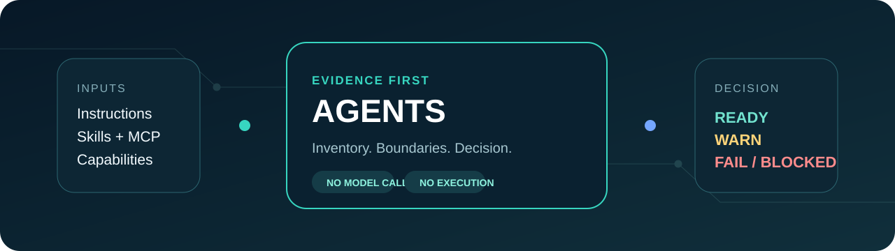

<p align="center">
  
</p>

# Evidence First Agents

[](https://github.com/ali-kin4/evidence-first-agents/actions/workflows/ci.yml)
[](https://www.python.org/)
[](LICENSE)

Deterministic readiness and boundary checks for AI-agent projects.

Evidence First Agents inventories repository instructions, Agent Skills, local MCP
configuration, and declared high-authority capabilities. It produces stable JSON and
reviewer-friendly Markdown without calling a model, executing discovered commands, or contacting
configured servers.

The promise is deliberately narrow: **READY means the declared checks passed for the files
inspected.** It does not prove that an agent is universally safe, correct, or resistant to every
prompt-injection attack.

## Why this exists

Modern agent projects distribute authority across several surfaces:

- `AGENTS.md`, `CLAUDE.md`, and `GEMINI.md`;
- reusable `SKILL.md` packages and their local references;
- MCP commands, remote URLs, transports, and credentials;
- browser, network, shell, file, and external-account tools;
- approval rules that may exist only in prose.

That makes basic review harder than it should be. A project can look tidy while containing a
broken skill reference, ambiguous remote transport, literal credential, wildcard tool scope, or
an external write capability with no explicit approval boundary.

This project turns those expectations into inspectable checks that run locally and in CI.

## Quick start

```bash
git clone https://github.com/ali-kin4/evidence-first-agents.git
cd evidence-first-agents
python -m pip install -e ".[dev]"

evidence-first-agents examples/safe-agent
```

Write both report formats:

```bash
evidence-first-agents . \
  --json-out reports/agent-readiness.json \
  --markdown-out reports/agent-readiness.md
```

Print JSON instead of Markdown:

```bash
evidence-first-agents . --format json
```

## Demonstration fixtures

The repository includes three intentionally small fixtures:

| Fixture | Expected decision | What it demonstrates |
|---|---|---|
| `examples/safe-agent` | `READY` | explicit transports, environment-held credential, valid skill reference, approval boundary |
| `examples/ambiguous-agent` | `WARN` | missing policy contract, conflicting instruction surfaces, ambiguous remote transport |
| `examples/unsafe-agent` | `FAIL` | literal credential, wildcard tools, external publishing without required approval |

These fixtures validate the workflow. They are not evidence that a real deployed agent is safe.

## What is inspected

### Automatic inventory

- root-level `AGENTS.md`, `CLAUDE.md`, and `GEMINI.md`;
- `SKILL.md` files and local Markdown references;
- `.mcp.json`, `mcp.json`, `.cursor/mcp.json`, and `.vscode/mcp.json`;
- MCP server names, transport types, and the presence of commands or URLs;
- capabilities declared in `evidence-first-agents.toml`.

The JSON report excludes credential values and does not include full instruction or skill
contents.

### Initial checks

| Code | Meaning |
|---|---|
| `REQUIRED_INSTRUCTION_MISSING` | a policy-required root instruction file is absent |
| `INSTRUCTION_PRECEDENCE_UNDECLARED` | several root instruction surfaces exist without precedence |
| `SKILL_NAME_MISSING` | skill frontmatter has no `name` |
| `SKILL_DESCRIPTION_MISSING` | skill frontmatter has no `description` |
| `SKILL_REFERENCE_MISSING` | a local skill resource cannot be resolved |
| `SKILL_REFERENCE_OUTSIDE_ROOT` | a skill reference leaves the project boundary |
| `MCP_TRANSPORT_UNSPECIFIED` | a remote MCP endpoint has no unambiguous transport |
| `EMBEDDED_SECRET` | a credential-like JSON field contains a literal rather than an environment reference |
| `CAPABILITY_SOURCE_MISSING` | a declared capability points to missing local evidence |
| `APPROVAL_BOUNDARY_MISSING` | a high-authority write capability lacks required approval |
| `WILDCARD_TOOL_SCOPE` | a declared capability uses `*` as its tool scope |

See [the contract reference](docs/contract.md) for the complete status and configuration model.

## Policy contract

The contract is optional for exploratory scans and required for a clean `READY` decision:

```toml
[project]
name = "my-agent-project"

[policy]
required_instruction_files = ["AGENTS.md"]
instruction_precedence = ["AGENTS.md", "CLAUDE.md"]
require_explicit_approval_for = [
  "browser_write",
  "external_account_write",
  "network_write",
]

[[capabilities]]
id = "github-publish"
kind = "external_account_write"
source = ".mcp.json"
approval = "required"
tools = ["issues.comment"]
```

Capabilities make authority reviewable without pretending that keyword scanning can infer every
runtime permission correctly.

## Decisions and exit codes

| Decision | Exit | Interpretation |
|---|---:|---|
| `READY` | 0 | no declared checks produced findings |
| `WARN` | 0 | inspectable configuration contains material ambiguity |
| `FAIL` | 1 | a declared boundary is violated |
| `BLOCKED` | 2 | required evidence cannot be resolved or parsed |

Blocked evidence takes precedence over a failure because the project cannot be completely
evaluated.

## Security properties

The scanner:

- reads files only inside the selected project;
- does not execute discovered shell commands;
- does not connect to MCP servers or URLs;
- does not call an LLM;
- does not print discovered credential values;
- resolves skill and capability paths before using them;
- emits deterministic reports without timestamps.

Read [the threat model](docs/threat-model.md) before using a report as part of a production
approval process.

## Development

```bash
python -m pip install -e ".[dev]"
ruff check .
pytest
python -m build
evidence-first-agents examples/safe-agent
```

CI runs lint and tests on Windows and Ubuntu using Python 3.11, 3.12, and 3.13. A separate package
job builds the wheel and source archive, installs the wheel into a clean environment, and runs the
safe fixture.

## Current boundaries

Version 0.1.0 does not:

- formally verify agent behavior;
- execute an agent or inspect runtime traces;
- parse every provider-specific configuration format;
- detect arbitrary secrets in prose;
- prove that an approval prompt cannot be bypassed;
- establish trust in third-party MCP servers or skills;
- replace sandboxing, least privilege, code review, or human judgment.

Provider adapters and checks should be added only with realistic fixtures and a stable,
documented failure mode.

See the [public roadmap](ROADMAP.md) for the evidence gates and candidate scope for the next
release.

## Relationship to Evidence First AI

[Evidence First AI](https://github.com/ali-kin4/evidence-first-ai-project) checks whether an
applied-AI claim is connected to declared experimental evidence. Evidence First Agents checks
whether an agent project's authority and configuration are inspectable. The projects share a
status vocabulary but solve different problems.

## Work with Ali

I build auditable AI, scientific-computing, automation, and technical-learning systems for
students, research teams, and organizations.

Start at [AliJabbary.com](https://alijabbary.com) or email
[info@AliJabbary.com](mailto:info@AliJabbary.com).

## License

Released under the [MIT License](LICENSE).
